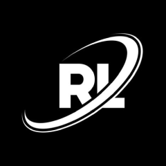

# RLauncher

<p align="center">
  
</p>

<p align="center">
  <b>A lightweight, fast, and open-source Minecraft launcher.</b>
</p>

<p align="center">
  <a href="#features">Features</a> •
  <a href="#installation">Installation</a> •
  <a href="#development">Development</a> •
  <a href="#contributing">Contributing</a> •
  <a href="#license">License</a>
</p>

---

## Features

* **Offline Mode** — Launch Minecraft without an online account using locally generated offline UUIDs.
* **Full Version Support** — Supports Minecraft releases, snapshots, betas, and alphas.
* **Automatic Java Detection** — Detects installed Java versions and selects the appropriate runtime for the selected Minecraft version.
* **Minecraft-Inspired UI** — Includes Deepslate-inspired dark and Smooth Stone-inspired light themes.
* **Integrated Console** — View live Minecraft output directly from the launcher.
* **Configurable Settings** — Manage RAM allocation, Java installation paths, and game directories.
* **Automatic Downloads** — Downloads required libraries, natives, assets, and version files automatically with SHA-1 verification.
* **Cross-Platform** — Available for Windows and Linux.
* **Discord Rich Presence** — Display your current Minecraft version and launcher activity on Discord.

## Screenshots

Screenshots will be added soon.

## Installation

### Windows

1. Download the latest installer from the [Releases](../../releases) page.
2. Run the installer.
3. Follow the installation wizard.

### Linux

#### AppImage

The AppImage is the recommended option for most Linux distributions.

```bash
chmod +x RLauncher-*.AppImage
./RLauncher-*.AppImage
```

Download the latest AppImage from the [Releases](../../releases) page.

#### Debian / Ubuntu

```bash
sudo dpkg -i rlauncher_*_amd64.deb
```

### Java Requirements

| Minecraft Version | Required Java |
| ----------------- | ------------- |
| 1.16.5 and older  | Java 8+       |
| 1.17 – 1.20.4     | Java 17+      |
| 1.20.5 and newer  | Java 21+      |

RLauncher automatically detects installed Java versions and selects the appropriate version when possible.

## Development

### Requirements

* Node.js 18 or newer
* npm
* Git

### Setup

```bash
git clone https://github.com/RealVhdg/RLauncher.git
cd RLauncher
npm install
```

### Running

Start RLauncher normally:

```bash
npm start
```

Start RLauncher with DevTools enabled:

```bash
npm run dev
```

### Building

Build for Linux:

```bash
npm run build:linux
```

Build for Windows:

```bash
npm run build:win
```

Build for all supported platforms:

```bash
npm run build:all
```

## Project Structure

```text
RLauncher/
├── main.js                 # Electron main process
├── preload.js              # Secure IPC bridge
├── core/
│   ├── config.js           # Configuration management
│   ├── version-manager.js  # Minecraft version management
│   ├── downloader.js       # Asset, library, and native downloads
│   ├── launcher.js         # Minecraft launch process
│   ├── java-finder.js      # Java runtime detection
│   └── discord-rpc.js      # Discord Rich Presence integration
├── src/
│   ├── index.html          # Main interface
│   ├── styles/
│   │   └── main.css        # UI styles
│   └── js/
│       └── renderer.js     # Renderer-side logic
├── logo.png
├── package.json
├── LICENSE
├── Notice.md
└── README.md
```

## Contributing

Contributions, bug reports, and suggestions are welcome.

Before opening a pull request:

1. Fork the repository.
2. Create a feature branch:

```bash
git checkout -b feature/new-feature
```

3. Make your changes and commit them:

```bash
git commit -m "Add new feature"
```

4. Push your branch:

```bash
git push origin feature/new-feature
```

5. Open a Pull Request and describe your changes.

For larger changes, consider opening an issue first to discuss the proposed implementation.

## License

RLauncher is licensed under the **GNU General Public License v3.0**.

See [LICENSE](LICENSE) for the full license text and [Notice.md](NOTICE.md) for additional project notices.

---

<p align="center">
  <sub>RLauncher is an independent open-source project.</sub>
</p>
